# S-Thymeleaf-SSTI漏洞

## `SpingMVC`视图解析
**参考文章**
* [springmvc视图解析器详解](https://blog.csdn.net/Eaeyson/article/details/125205228)

> 当一个请求被`HandlerMapping`处理完后,会返回一个`ModelAndView`对象,`springmvc`借助视图解析器(`ViewResolver`)得到最终将逻辑视图解析为视图对象(`View`),最终的视图可以是`jsp,html`,也可能是`Excel`等,转换成对应的`View`对象后渲染给用户,即返回浏览器,在这个渲染过程中,发挥作用的就是`ViewResolver`和`View`两个接口
当需要在`SpringMVC`中使用视图解析的时候就需要配置识图解析器，通常用到的解析器便是`InternalResourceViewResolver`.

```java
Controller
public class LoginController {
    @RequestMapping(value = "login")
    public String login() {
        return "login";
    }
}
 
//在springmvc中没有配置视图解析器的情况下,访问/login,会报错,错误的大概意思就是没有正确设置转发(或包含)到请求调度程序路径
//意思就是把逻辑视图解析后的URL路径还是/login,因为默认情况下该视图解析器解析视图是没有配置前缀和后缀的
```
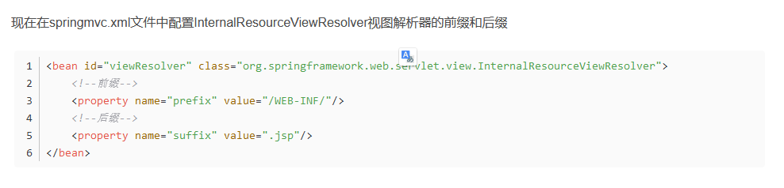

>自然，还可以在`SpringMVC`中配置`Thymeleaf`视图解析器。

```java
<!-- 配置Thymeleaf视图解析器 -->
<bean id="viewResolver" class="org.thymeleaf.spring5.view.ThymeleafViewResolver">
    <property name="order" value="1"/>
    <property name="characterEncoding" value="UTF-8"/>
    <property name="templateEngine">
        <bean class="org.thymeleaf.spring5.SpringTemplateEngine">
            <property name="templateResolver">
                <bean class="org.thymeleaf.spring5.templateresolver.SpringResourceTemplateResolver">
                    <!-- 视图前缀 -->
                    <property name="prefix" value="/WEB-INF/"/>
                    <!-- 视图后缀 -->
                    <property name="suffix" value=".html"/>
                    <property name="templateMode" value="HTML5"/>
                    <property name="characterEncoding" value="UTF-8" />
                </bean>
            </property>
        </bean>
    </property>
</bean>
```

## `Springboot`自动装配原理
**参考文章**
* [76.8 自定义ViewResolvers](https://jack80342.gitbook.io/spring-boot/ix.-how-to-guides/76.-spring-mvc/76.8-customize-viewresolvers)
* [Spring Boot应用配置常用相关视图解析器详解](https://www.mianshigee.com/note/detail/62787ftl/)
* [springboot自动装配](https://blog.csdn.net/qq_57434877/article/details/123933529)
* [Spring Boot自动配置原理分析](https://www.cnblogs.com/yft-javaNotes/p/11190888.html)

>在使用`springboot`的时候，通过自动装配为我们默认配置了`InternalResourceViewResolver`作为视图解析器，我们通过配置文件便可以配置视图解析。自动装配的原理可以看参考文章，写的很详细。

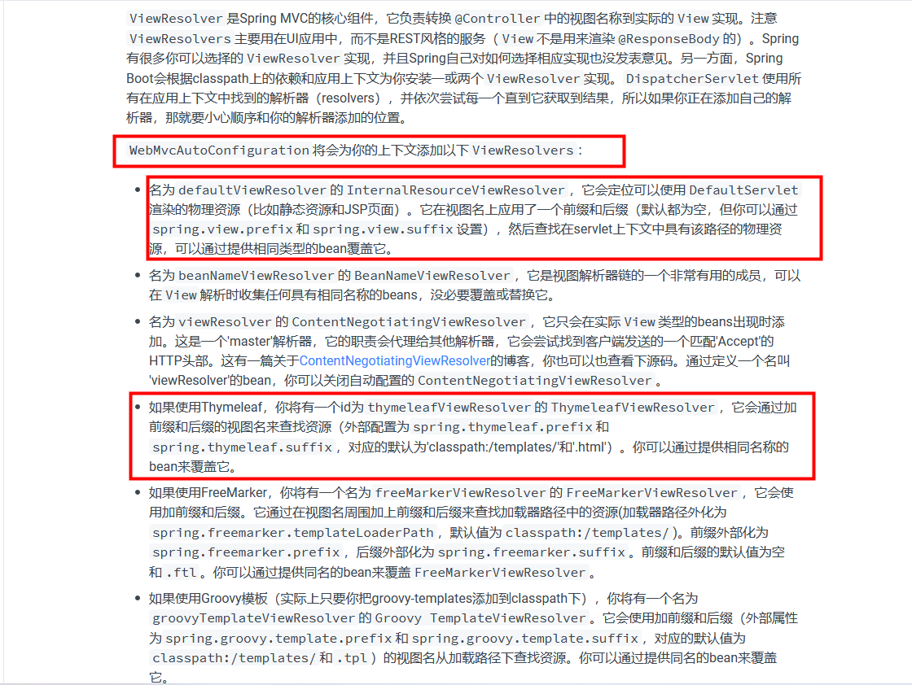

```xml
spring.mvc.view.prefix=/
spring.mvc.view.suffix=.jsp
```
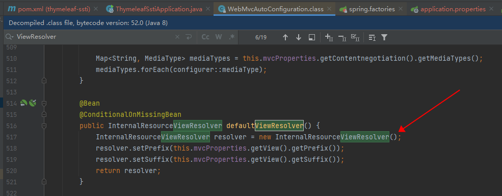

>当我们配置了`thymeleaf`视图解析器的时候，`ContentNegotiatingViewResolver()`这个代理解析器会通过匹配`Accept`请求头选择对应的解析器，可以看到`Thymeleaf`的解析配置设置了解析格式。

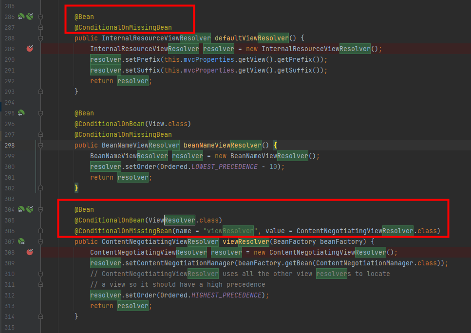
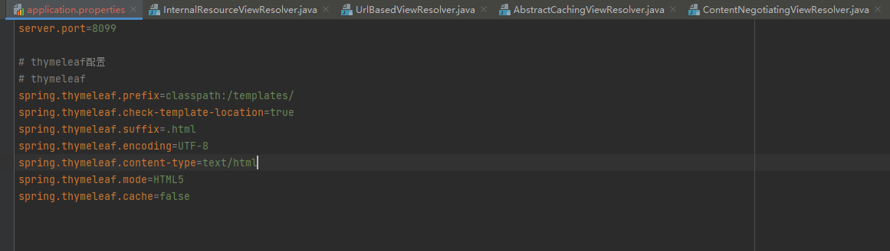

>在源码中也是可以看到的，注册了四个视图解析器，然后会挨个解析这个请求内容。

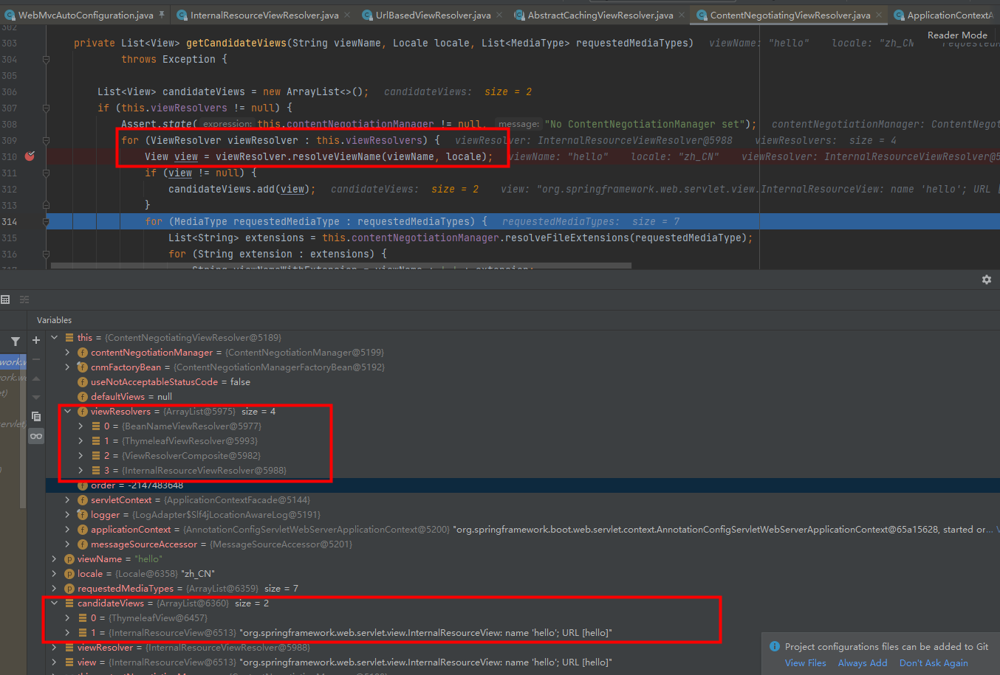

## 解析流程
>发起一次正常的访问，然后跟踪一下中间的流程。最终目的是定位到`Thymeleaf`解析模板的位置。
当一个请求被处理完，进入到`View`阶段，首先是通过`ContentNegotiatingViewResolver`这个代理解析器进入到`ContentNegotiatingViewResolver.resolveViewName()`方法，然后进入到`getCandidateViews()`方法，这个方法中会根据`MediaType`也就是请求头内容来判断是否使用某个解析器。

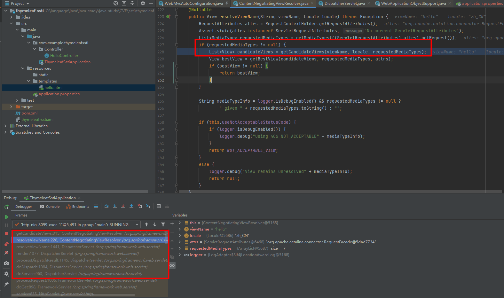
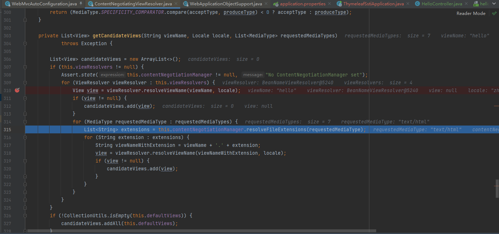

>在`getCandidateViews()`获取到解析器之后，会返回默认的解析器和`Thymeleaf`解析器这两个，随后会进入到一个`getBestView`的方法中，这个方法会返回最合适的一个一个解析器。
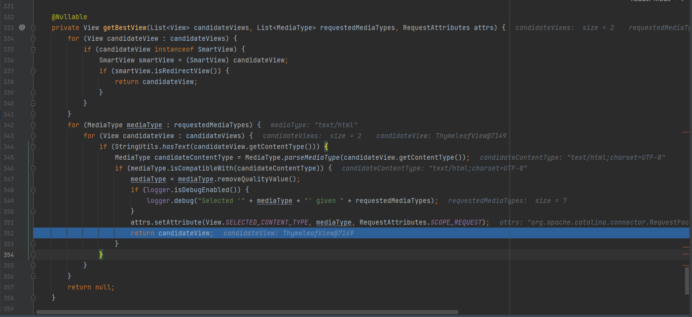


>在获取到解析器之后，就会进入对应解析器的`render`方法当中，这里进入到`ThymeleafView.java#render()`方法。
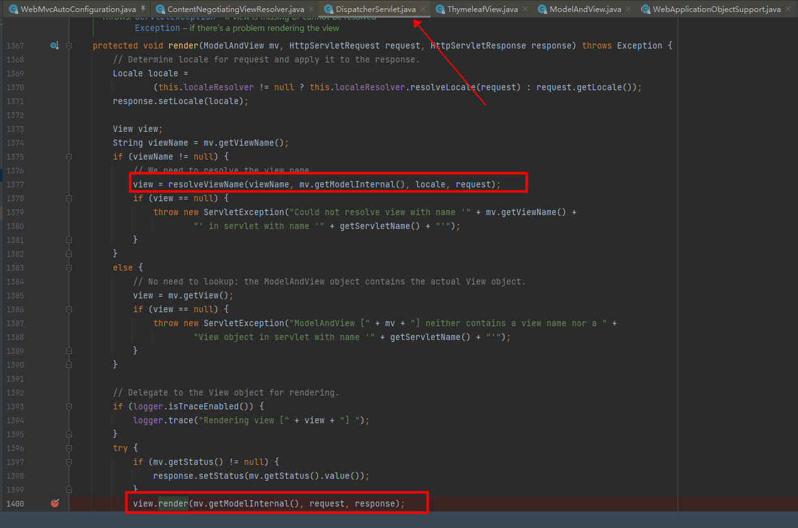
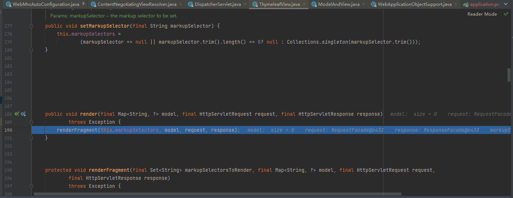

>当进入到`renderFragment()`方法之后发现其中有一个判断，就是根据`viewTempelateName`这个变量是否包含`::`，如果包含会进入到`parser.parseExpression()`这个方法，这个也是片段表达式解析。看到`parseExpression`不经想到了表达式解析，可能`Thymeleaf`的`SSTI`漏洞就出在此处。然后因为我们当前的`viewTempelateName`是`hello`，不会进入这个表达式解析，最后会到后面的`viewTemplateEngine.process(templateName, processMarkupSelectors, context, templateWriter);`，这个解析完成之后也就是显示的内容了。

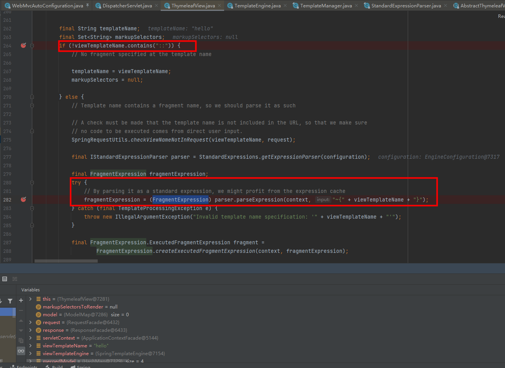
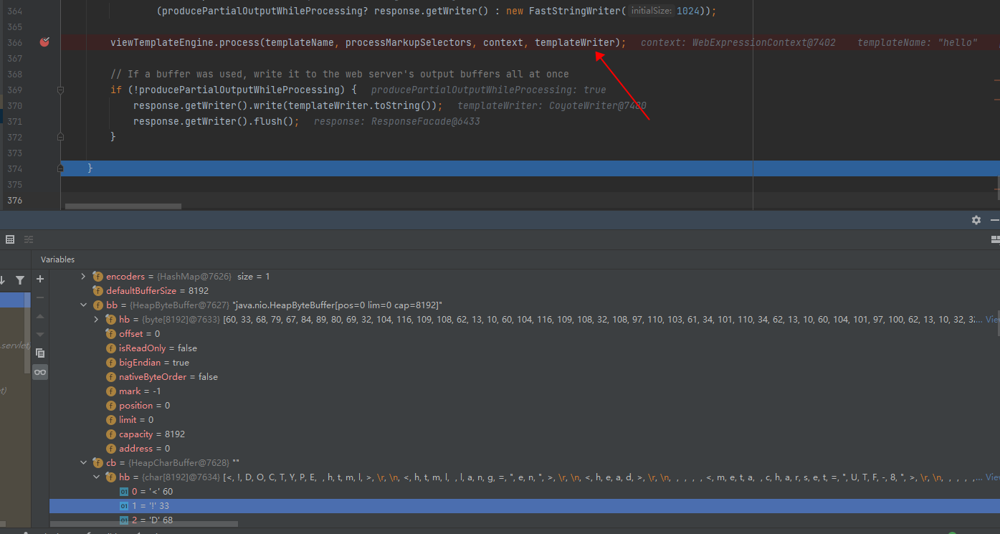


## 片段表达式解析过程

>首先根据进入条件我们传递的`payload`应该包含`::`.然后根据`fragmentExpression = (FragmentExpression) parser.parseExpression(context, "~{" + viewTemplateName + "}");`这行代码，最终调用的是`StandardExpressions.parseExpression(context, "~{::payload}")`，再之后调用`StandardExpressions。parseExpression(context, "~{::payload}", true)`。这个函数内部会根据`preprocess`属性来判断接下来的操作，我们传递的为`True`，所以进入到`StandardExpressionPreprocessor.preprocess(context, input)`当中。

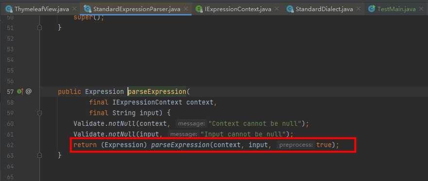
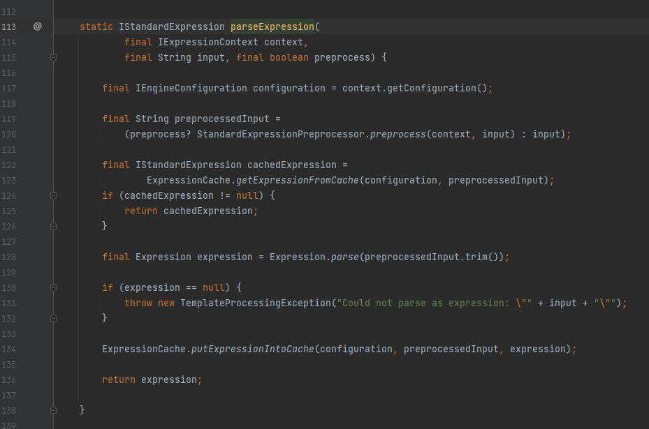


>接下来调试跟踪一下中间的一些流程。按照测试案例和上面的分析，当请求`/ssti.html`之后就会进入到`preprocess()`方法当中。这个方法首先是匹配输入是否包含`_`下划线。然后会根据`\_\_(.*?)\_\_`这个正则表达式对我们的输入进行匹配。所以我们的`payload`格式应该满足`__payloadasdasd__::sa`

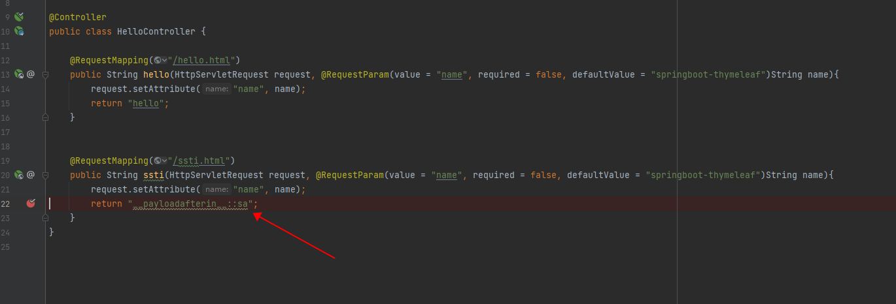
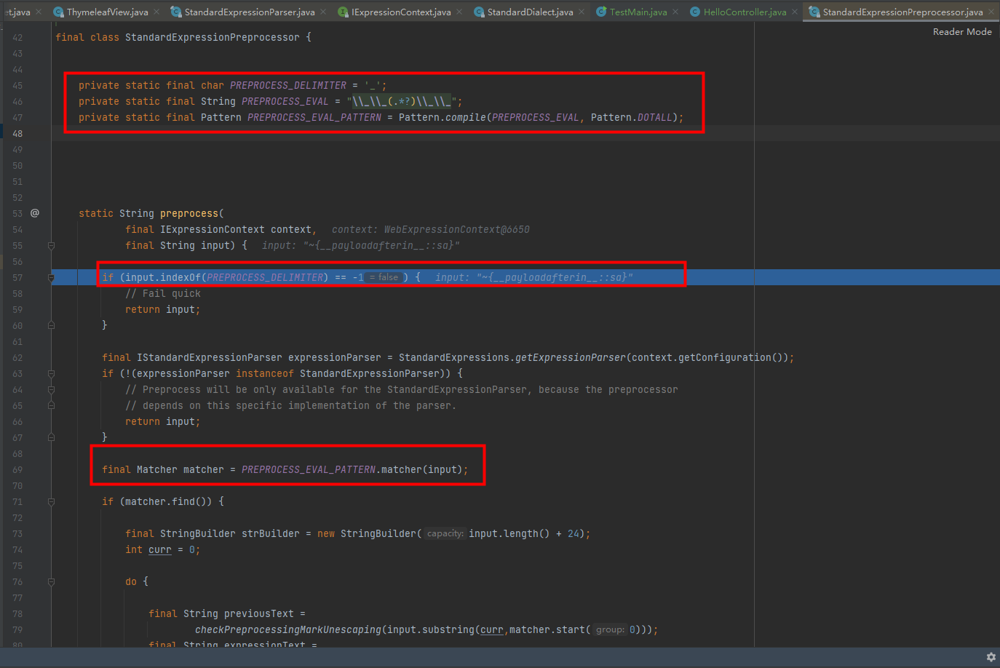

>在进行正则匹配之后，会根据正则结果调用函数`checkPreprocessingMarkUnescaping`进行处理。我们主要看`matcher.group(1)`的处理。

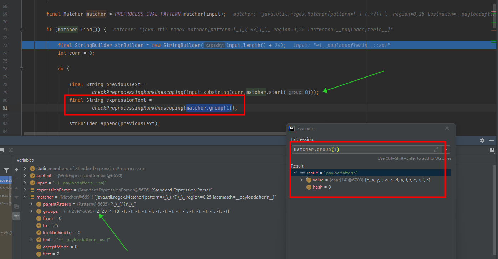
```java
private static String checkPreprocessingMarkUnescaping(final String input) {
        
        boolean structureFound = false; // for fast failing
        
        byte state = 0; // 1 = \, 2 = _, 3 = \, 4 = _
        final int inputLen = input.length();
        for (int i = 0; i < inputLen; i++) {
            final char c = input.charAt(i);
            if (c == '\\' && (state == 0 || state == 2)) {
                state++;
                continue;
            }
            if (c == '_' && state == 1) {
                state++;
                continue;
            }
            if (c == '_' && state == 3) {
                structureFound = true;
                break;
            }
            state = 0;
        }

        if (!structureFound) {
            // This avoids creating a new String object in the most common case (= nothing to unescape)
            return input;
        }


        state = 0; // 1 = \, 2 = _, 3 = \, 4 = _
        final StringBuilder strBuilder = new StringBuilder(inputLen + 6);
        for (int i = 0; i < inputLen; i++) {
            final char c = input.charAt(i);
            if (c == '\\' && (state == 0 || state == 2)) {
                state++;
                strBuilder.append('\\');
            } else if (c == '_' && state == 1) {
                state++;
                strBuilder.append('_');
            } else if (c == '_' && state == 3) {
                state = 0;
                final int builderLen = strBuilder.length(); 
                strBuilder.delete(builderLen - 3, builderLen);
                strBuilder.append("__");
            } else {
                state = 0;
                strBuilder.append(c);
            }
        }
        
        return strBuilder.toString();
        
    }
```

>根据前面一部分的逻辑，主要判断`payload`中是否带有`_`,`\`,后面直接返回了`payload`。然后再回到`preprocess`的逻辑当中，进入到后面的步骤`StandardExpressionParser.parseExpression(context, expressionText, false);`这里`StandardExpressionParser.parseExpression`和上面的是同一个函数，只不过这一次传递的是`False`，所以`preprocessedInput`变量就是我们的`payload`。

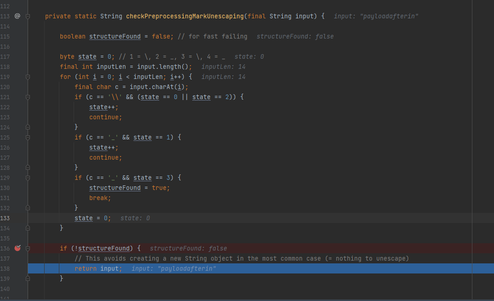
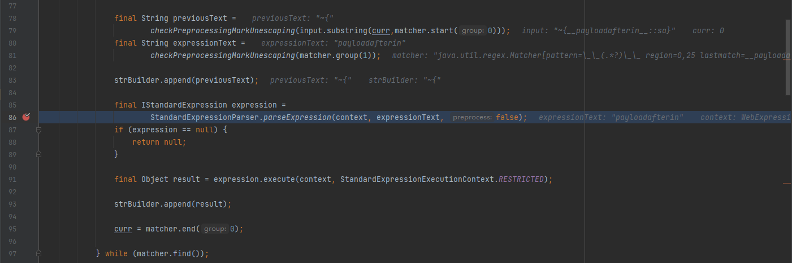
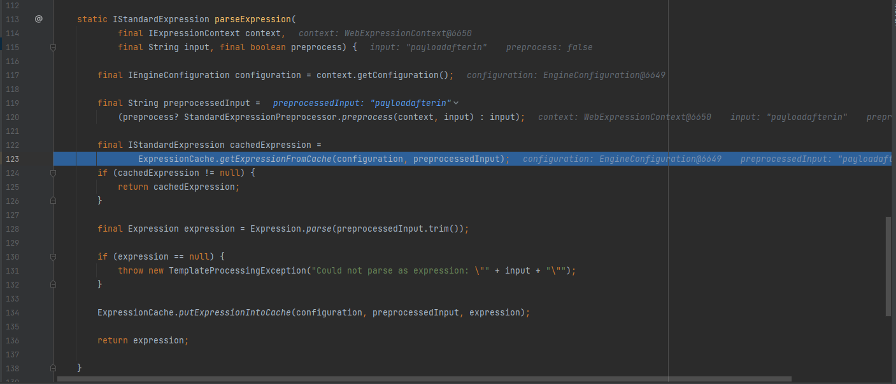

>之后是获取缓存解析器，这里`IStandardExpression`类是一个接口类，是用来规范解析器的，根据不同的内容，会调用不同的解析器。如果这个片段表达式之前被解析过，这里就可以获取到之前的解析器。如果为空就进入到下一步`final Expression expression = Expression.parse(preprocessedInput.trim());`，可以看到这里返回的是一个`Expression`类型的解析器，这个解析器是一个抽象类，实现了`IStandardExpression`接口，同时也是很多其他解析器的父类。这一步其实就是根据我们输入的内容来选择不同的解析器。

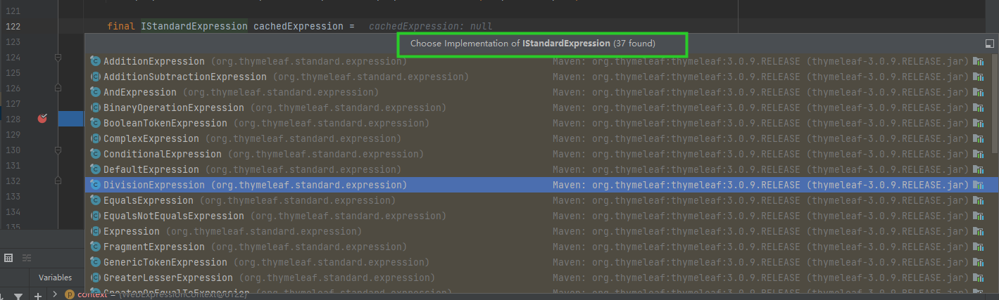
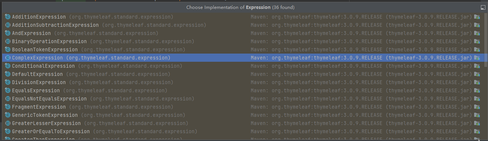
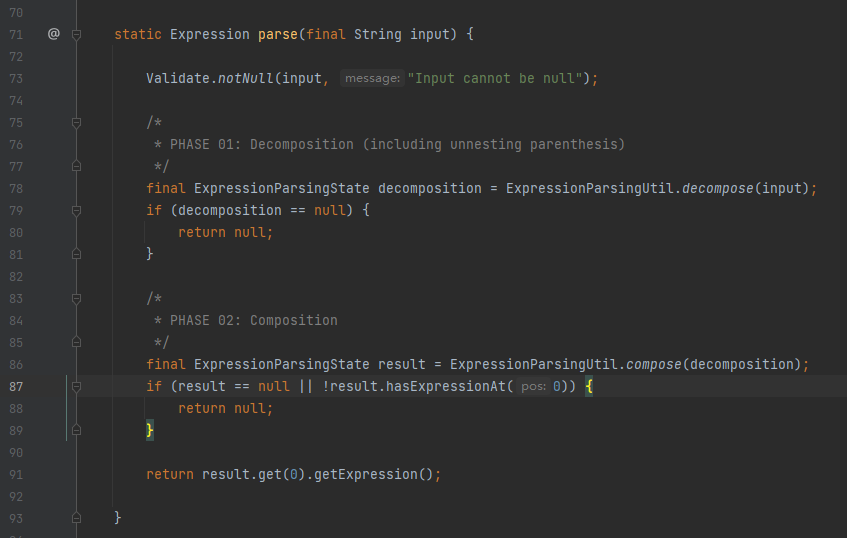

>将解析器返回之后回到`preprocess`方法当中，然后执行`final Object result = expression.execute(context, StandardExpressionExecutionContext.RESTRICTED);`，这一步就是表达式解析的过程。可以看到将`${'HEllo'.toLowerCase()}`这个表达式解析成功`hello`。而且用的应该是`Spel`表达式解析器。
首先是获取可用的表达式解析执行器`StandardExpressions.getVariableExpressionEvaluator(context.getConfiguration())`，这里返回的就是标准的执行器`StandardVariableExpressionEvaluator`，也就是`Spel`表达式解析器。

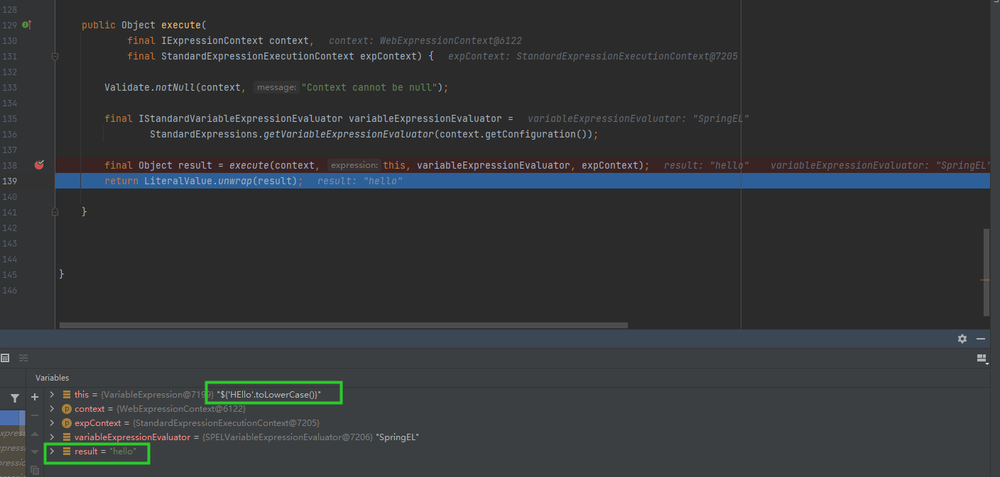
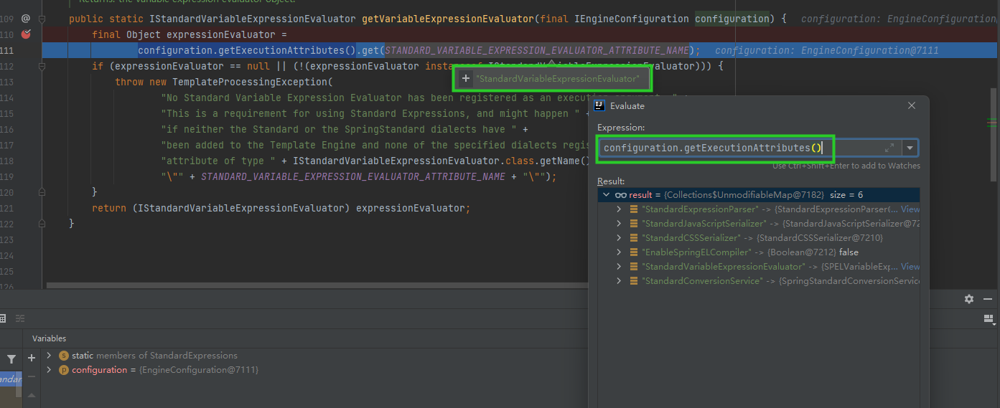

>获取到解析器之后进入执行`final Object result = execute(context, this, variableExpressionEvaluator, expContext)`->`SimpleExpression.executeSimple(context, (SimpleExpression)expression, expressionEvaluator, expContext)`->`VariableExpression.executeVariableExpression(context, (VariableExpression)expression, expressionEvaluator, expContext);`->`expressionEvaluator.evaluate(context, expression, evalExpContext);`

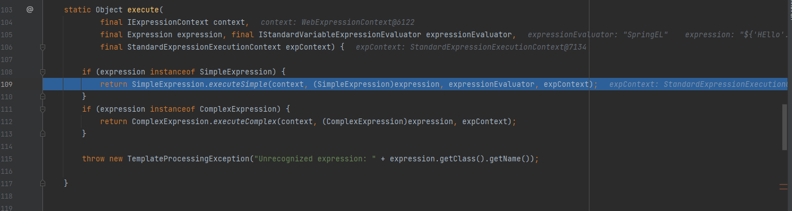
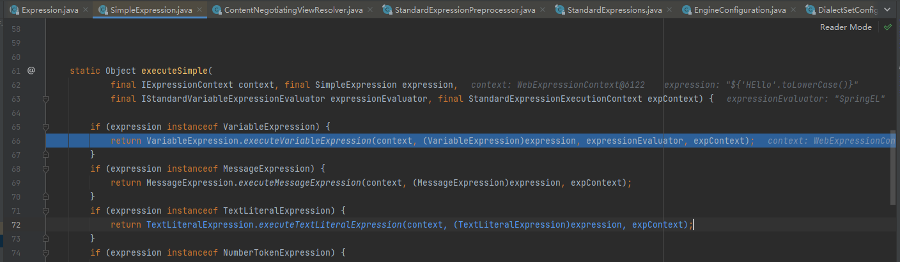
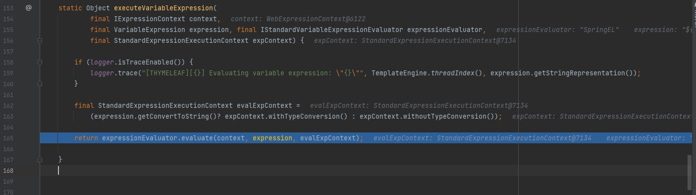


>最后一步是进入表达式解析的过程当中。

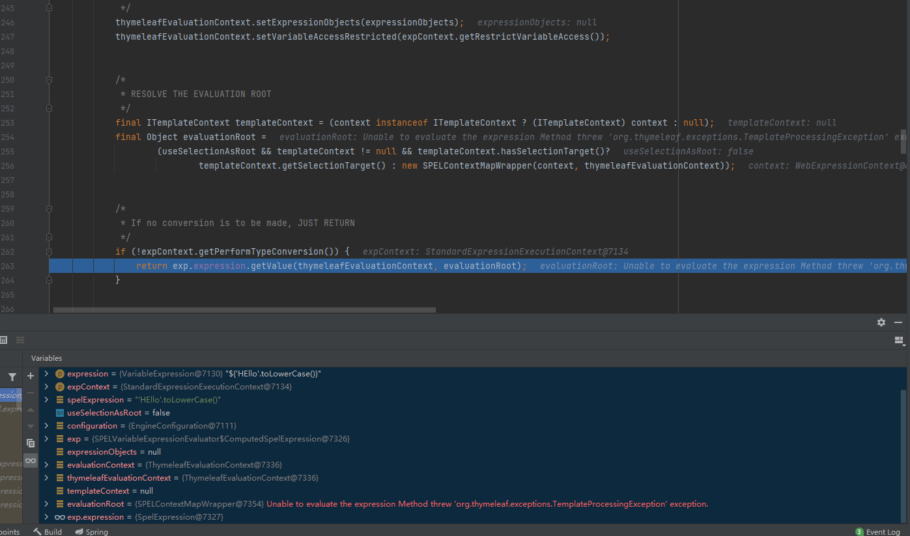
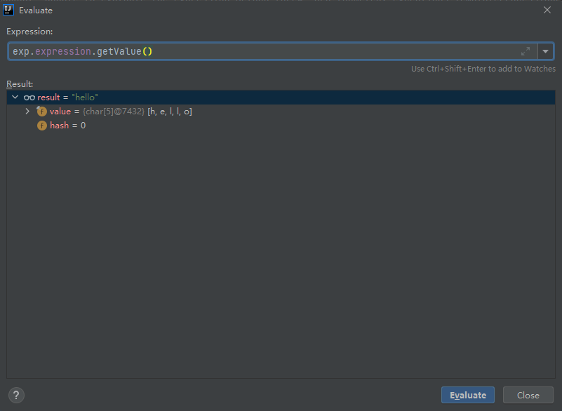


## 其他的利用情况
>上面的分析已经将片段表达式的解析过程大致了解了，而且利用的条件是我们的输入被当成模板路径来解析，而`Themeleaf`还有其他的情况。比如，在模板文件内存在表达式需要解析，而内容可控。

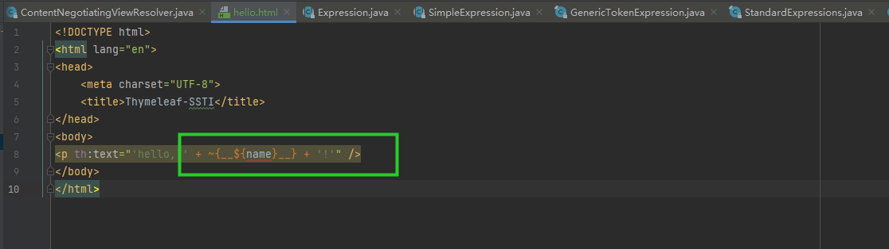
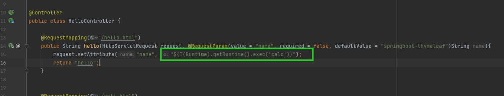
>这模板的内容理解起来就是首先通过变量表达式将我们的输入填充到片段表达式中，然后利用片段表达式来进行解析，这样就通用可以触发SSTI漏洞了。

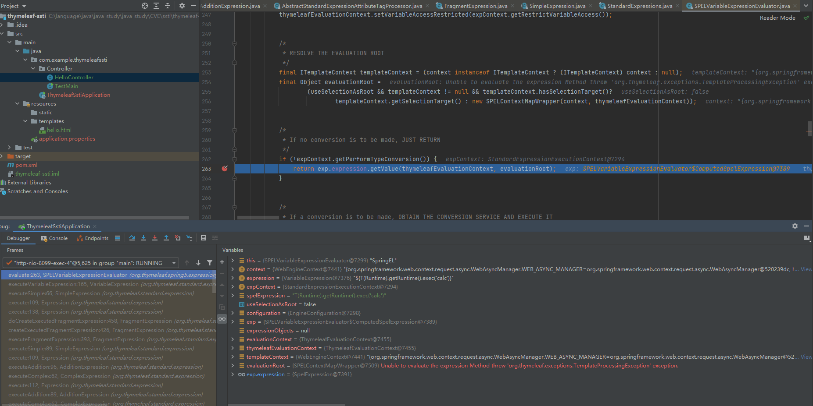
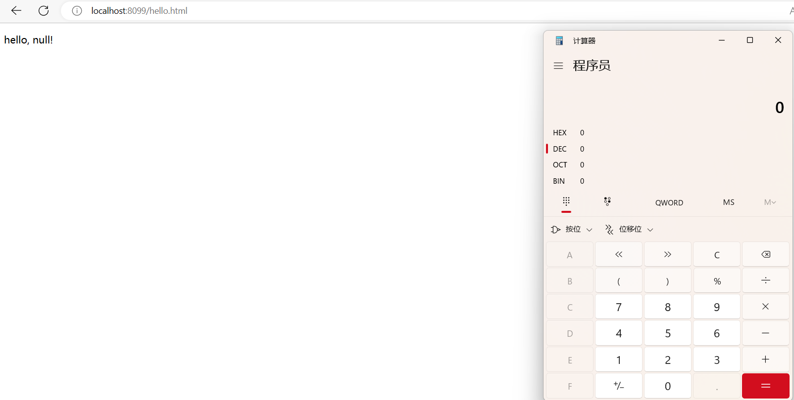

## 漏洞版本限制
>对于漏洞应该具有版本限制，在使用即成环境时`spring-boot-starter-parent`的版本为`2.0.3.RELEASE`可以触发，当版本为`2.6.1`进行表达式解析过程中会出错。

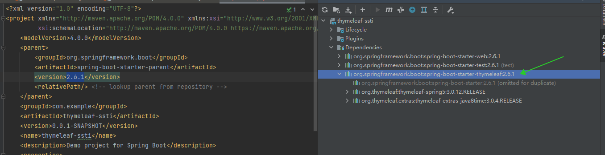
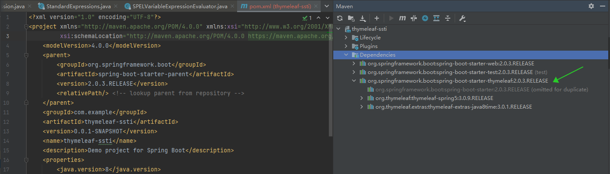

**参考文章**
* [Thymeleaf SSTI漏洞分析](https://xz.aliyun.com/t/10514)
* [Java安全之Thymeleaf SSTI分析](https://www.anquanke.com/post/id/254519)