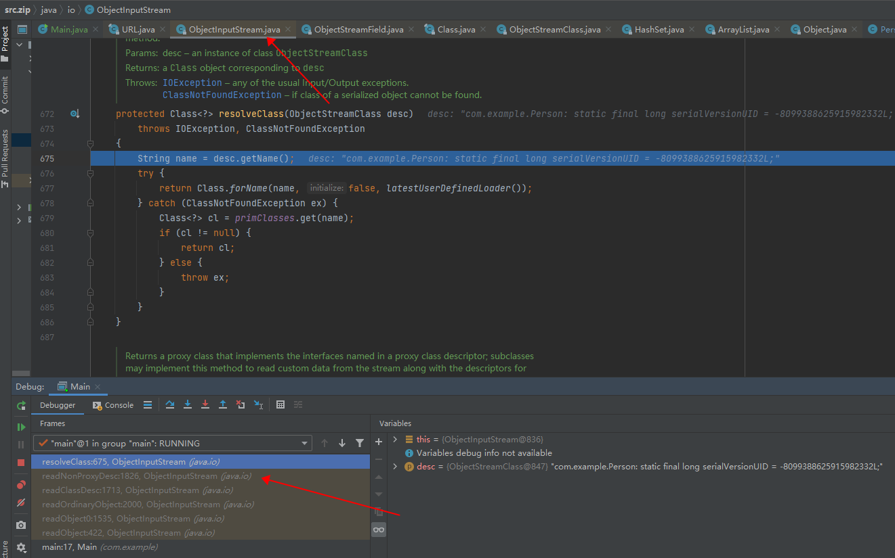

# S-java反序列化过程学习
**参考文章**
* [反序列化流程分析总结](https://www.cnpanda.net/sec/928.html)
* [序列化原理（一）：从源码理解Serializable](https://blog.csdn.net/u011315960/article/details/89963230)
* [21.Java序列化【草案三】](https://blog.csdn.net/silentbalanceyh/article/details/8294269)
* [Java Object Serialization Specification](https://docs.oracle.com/javase/7/docs/platform/serialization/spec/serialTOC.html)

## 测试用例

```java
package com.example;

import java.io.IOException;
import java.io.ObjectInputStream;
import java.io.Serializable;
import java.net.URL;

public class Person implements Serializable {
    public String name;
    protected String address;
    private String phone;
    public java.net.URL URL;

    transient public String sex;
    public static String age="20";

    public Person(String name, String address, String phone, String sex,URL url) {
        this.name = name;
        this.address = address;
        this.phone = phone;
        this.sex = sex;
        this.URL=url;
        System.out.println("有参构造");
    }

    public Person() {
        System.out.println("无参构造");
    }

    @Override
    public String toString() {
        return "Person{" +
                "name='" + name + '\'' +
                ", address='" + address + '\'' +
                ", phone='" + phone + '\'' +
                ", sex='" + sex + '\'' +
                '}';
    }

    public String getName() {
        System.out.println("调用getname");
        return name;
    }

    public void setName(String name) {
        System.out.println("调用setname");

        this.name = name;
    }

    public String getAddress() {
        System.out.println("调用getaddress");
        return address;
    }

    public void setAddress(String address) {
        System.out.println("调用setaddress");
        this.address = address;
    }

    public String getPhone() {
        System.out.println("调用getphone");
        return phone;
    }

    public void setPhone(String phone) {
        System.out.println("调用setphone");
        this.phone = phone;
    }

    public String getSex() {
        System.out.println("调用getsex");
        return sex;
    }

    public void setSex(String sex) {
        System.out.println("调用setsex");

        this.sex = sex;
    }

    public static String getAge() {
        System.out.println("调用getage");

        return age;
    }

    public static void setAge(String age) {
        System.out.println("调用setage");
        Person.age = age;
    }

    public java.net.URL getURL() {
        System.out.println("调用geturl");
        return URL;
    }

    public void setURL(java.net.URL URL) {
        System.out.println("调用seturl");
        this.URL = URL;
    }

    private void readObject(ObjectInputStream inputStream)throws IOException {
        System.out.println("重写readObject");
    }
}
```

## `ObjectInputStream`初始化
>`ObjectInputStream`存在两个构造方法,一个`public`类型的单参构造,一个`protected`类型的无参构造.


>`verifySubclass()`方法,根据官方的解释--验证是否可以在不违反安全约束的情况下构造此（可能是子类）实例：子类不得覆盖对安全敏感的非最终方法，否则将检查"enableSubclassImplementation" SerializablePermission。


>`bin=new BlockDataInputStream(in)`，这一步有点关键，后面对于数据流的处理，都是通过这个`BlockDataInputStream`类来做的，所以需要理解一下这个类。`BlockDataInputStream`是一个内部类。

```java
private class BlockDataInputStream
        extends InputStream implements DataInput
    {
        /** maximum data block length */
        private static final int MAX_BLOCK_SIZE = 1024;
        /** maximum data block header length */
        private static final int MAX_HEADER_SIZE = 5;
        /** (tunable) length of char buffer (for reading strings) */
        private static final int CHAR_BUF_SIZE = 256;
        /** readBlockHeader() return value indicating header read may block */
        private static final int HEADER_BLOCKED = -2;

        /** buffer for reading general/block data */
        private final byte[] buf = new byte[MAX_BLOCK_SIZE];
        /** buffer for reading block data headers */
        private final byte[] hbuf = new byte[MAX_HEADER_SIZE];
        /** char buffer for fast string reads */
        private final char[] cbuf = new char[CHAR_BUF_SIZE];

        /** block data mode */
        private boolean blkmode = false;

        // block data state fields; values meaningful only when blkmode true
        /** current offset into buf */
        private int pos = 0;
        /** end offset of valid data in buf, or -1 if no more block data */
        private int end = -1;
        /** number of bytes in current block yet to be read from stream */
        private int unread = 0;

        /** underlying stream (wrapped in peekable filter stream) */
        private final PeekInputStream in;
        /** loopback stream (for data reads that span data blocks) */
        private final DataInputStream din;

        /**
         * Creates new BlockDataInputStream on top of given underlying stream.
         * Block data mode is turned off by default.
         */
        BlockDataInputStream(InputStream in) {
            this.in = new PeekInputStream(in);
            din = new DataInputStream(this);
        }
    .............
}
```

>初始化`BlockDataInputStream`类的时候，又创建了一个`PeekInputStream`对象，继承了`InputStream`，实际的作用就是读取序列化流中的数据到`buf`中。在下面`readStreamHeader`方法中可以看到具体的具体的使用。


>`readStreamHeader();`这个方法用于读取序列化流的头部数据，也就是`aced0005`。`bin.readShort()`的内部流程大致是：`BlockDataInputStream.readShort()`->`PeekInputStream.readFully()`->`PeekInputStream.read()`->`ByteArrayInputStream.read()`.


## `readObject`过程
>在完成类的初始化之后进入到反序列化的过程中，也就是`readObject()`方法，然后进入到`readObject0(false)`这个方法当中。


>在`readObject0()`中首先是`peekByte()`读取序列化流中的第五个字节的数据--115，这个字节是控制指令，表示的是后面的数据的类型。
[-84, -19, 0, 5, 115, 114, 0, 18, 99, 111, 109, 46, 101, 120, 97, 109, 112, 108, 101, 46, 80, 101, 114, 115, 111, 110, -113, -103, 48, -11, 6, 112, 78, 4, 2, 0, 4, 76, 0, 3, 85, 82, 76, 116, 0, 14, 76, 106, 97, 118, 97, 47, 11......]


>根据读取的控制指令，进入到`checkResolve(readOrdinaryObject(unshared))`这一分支，在这个分支当中，首先进入`readOrdinaryObject(unshared)`方法进行分析。

```java
private Object readOrdinaryObject(boolean unshared)
        throws IOException
    {
        if (bin.readByte() != TC_OBJECT) {
            throw new InternalError();
        }

        ObjectStreamClass desc = readClassDesc(false);
        desc.checkDeserialize();

        Class<?> cl = desc.forClass();
        if (cl == String.class || cl == Class.class
                || cl == ObjectStreamClass.class) {
            throw new InvalidClassException("invalid class descriptor");
        }

        Object obj;
        try {
            obj = desc.isInstantiable() ? desc.newInstance() : null;
        } catch (Exception ex) {
            throw (IOException) new InvalidClassException(
                desc.forClass().getName(),
                "unable to create instance").initCause(ex);
        }

        passHandle = handles.assign(unshared ? unsharedMarker : obj);
        ClassNotFoundException resolveEx = desc.getResolveException();
        if (resolveEx != null) {
            handles.markException(passHandle, resolveEx);
        }

        if (desc.isExternalizable()) {
            readExternalData((Externalizable) obj, desc);
        } else {
            readSerialData(obj, desc);
        }

        handles.finish(passHandle);

        if (obj != null &&
            handles.lookupException(passHandle) == null &&
            desc.hasReadResolveMethod())
        {
            Object rep = desc.invokeReadResolve(obj);
            if (unshared && rep.getClass().isArray()) {
                rep = cloneArray(rep);
            }
            if (rep != obj) {
                // Filter the replacement object
                if (rep != null) {
                    if (rep.getClass().isArray()) {
                        filterCheck(rep.getClass(), Array.getLength(rep));
                    } else {
                        filterCheck(rep.getClass(), -1);
                    }
                }
                handles.setObject(passHandle, obj = rep);
            }
        }

        return obj;
    }
```

>在这里面有一个重要的步骤`ObjectStreamClass desc = readClassDesc(false);`，我们先跟入查看这个函数最终的效果--根据数据流的第六个字节(114)判断进入的分支，此处进入到`TC_CLASSDESC`分支，然后进入函数`readNonProxyDesc(unshared);`。

```java
private ObjectStreamClass readClassDesc(boolean unshared)
        throws IOException
    {
        byte tc = bin.peekByte();
        ObjectStreamClass descriptor;
        switch (tc) {
            case TC_NULL:
                descriptor = (ObjectStreamClass) readNull();
                break;
            case TC_REFERENCE:
                descriptor = (ObjectStreamClass) readHandle(unshared);
                break;
            case TC_PROXYCLASSDESC:
                descriptor = readProxyDesc(unshared);
                break;
            case TC_CLASSDESC:
                descriptor = readNonProxyDesc(unshared);
                break;
            default:
                throw new StreamCorruptedException(
                    String.format("invalid type code: %02X", tc));
        }
        if (descriptor != null) {
            validateDescriptor(descriptor);
        }
        return descriptor;
    }
```


>`readNonProxyDesc`方法:读入并返回不是动态代理类的类的类描述符。 将`passHandle`设置为类描述符的分配句柄。 如果类描述符无法解析为本地`VM`中的类，则会将`ClassNotFoundException`与描述符的句柄相关联。这个方法在后续的属性实例化中也都会用到。

```java
   private ObjectStreamClass readNonProxyDesc(boolean unshared)
        throws IOException
    {
        if (bin.readByte() != TC_CLASSDESC) {
            throw new InternalError();
        }

        ObjectStreamClass desc = new ObjectStreamClass();
        int descHandle = handles.assign(unshared ? unsharedMarker : desc);
        passHandle = NULL_HANDLE;

        ObjectStreamClass readDesc = null;
        try {
            readDesc = readClassDescriptor();   //获取类描述符，包括类名，类中属性名称等等
        } catch (ClassNotFoundException ex) {
            throw (IOException) new InvalidClassException(
                "failed to read class descriptor").initCause(ex);
        }

        Class<?> cl = null;
        ClassNotFoundException resolveEx = null;
        bin.setBlockDataMode(true);
        final boolean checksRequired = isCustomSubclass();
        try {
            if ((cl = resolveClass(readDesc)) == null) {  //调用ObjectInputStream.resolveClass方法去校验，此处也是用于防御的反序列化的关键点。
                resolveEx = new ClassNotFoundException("null class");
            } else if (checksRequired) {
                ReflectUtil.checkPackageAccess(cl);
            }
        } catch (ClassNotFoundException ex) {
            resolveEx = ex;
        }

        // Call filterCheck on the class before reading anything else
        filterCheck(cl, -1);

        skipCustomData();

        try {
            totalObjectRefs++;
            depth++;
            desc.initNonProxy(readDesc, cl, resolveEx, readClassDesc(false));
        } finally {
            depth--;
        }

        handles.finish(descHandle);
        passHandle = descHandle;

        return desc;
    }
```

> 通过`readClassDescriptor()`读取类描述信息，封装到`ObjectStreamClass`类中。


>调用`ObjectInputStream.resolveClass()`方法加载类，获取`class`类对象。



>再回到`readOrdinaryObject`方法中，获取到类描述符之后，进入到又一个关键的函数`readSerialData`，这个函数应该就是读取序列化流中的数据内容了。


```java
/**
Reads (or attempts to skip, if obj is null or is tagged with a ClassNotFoundException) instance data for each serializable class of object in stream, from superclass to subclass. Expects that passHandle is set to obj's handle before this method is called.
*/
    private void readSerialData(Object obj, ObjectStreamClass desc)
        throws IOException
    {
        ObjectStreamClass.ClassDataSlot[] slots = desc.getClassDataLayout();
        for (int i = 0; i < slots.length; i++) {
            ObjectStreamClass slotDesc = slots[i].desc;

            if (slots[i].hasData) {
                if (obj == null || handles.lookupException(passHandle) != null) {
                    defaultReadFields(null, slotDesc); // skip field values
                } else if (slotDesc.hasReadObjectMethod()) {
                    ThreadDeath t = null;
                    boolean reset = false;
                    SerialCallbackContext oldContext = curContext;
                    if (oldContext != null)
                        oldContext.check();
                    try {
                        curContext = new SerialCallbackContext(obj, slotDesc);

                        bin.setBlockDataMode(true);
                        slotDesc.invokeReadObject(obj, this);
                    } catch (ClassNotFoundException ex) {
                        /*
                         * In most cases, the handle table has already
                         * propagated a CNFException to passHandle at this
                         * point; this mark call is included to address cases
                         * where the custom readObject method has cons'ed and
                         * thrown a new CNFException of its own.
                         */
                        handles.markException(passHandle, ex);
                    } finally {
                        do {
                            try {
                                curContext.setUsed();
                                if (oldContext!= null)
                                    oldContext.check();
                                curContext = oldContext;
                                reset = true;
                            } catch (ThreadDeath x) {
                                t = x;  // defer until reset is true
                            }
                        } while (!reset);
                        if (t != null)
                            throw t;
                    }

                    /*
                     * defaultDataEnd may have been set indirectly by custom
                     * readObject() method when calling defaultReadObject() or
                     * readFields(); clear it to restore normal read behavior.
                     */
                    defaultDataEnd = false;
                } else {
                    defaultReadFields(obj, slotDesc);
                    }

                if (slotDesc.hasWriteObjectData()) {
                    skipCustomData();
                } else {
                    bin.setBlockDataMode(false);
                }
            } else {
                if (obj != null &&
                    slotDesc.hasReadObjectNoDataMethod() &&
                    handles.lookupException(passHandle) == null)
                {
                    slotDesc.invokeReadObjectNoData(obj);
                }
            }
        }
            }
```
>在`slotDesc.hasReadObjectMethod()`会判断`Person`类是否存在`readObject`方法，如果存在，后续会调用该方法。这里如果`Person`类没有`readObject`方法，那么他将进入到另外一个分支去对数据进行处理。此处我的`readObject`方法中没有任何处理过程，所以最终反序列的`Person`对象属性都为`null`。


>接下来看另外一个处理分支`defaultReadFields(obj, slotDesc);`


```java
/**
Reads in values of serializable fields declared by given class descriptor. If obj is non-null, sets field values in obj. Expects that passHandle is set to obj's handle before this method is called.
*/
private void defaultReadFields(Object obj, ObjectStreamClass desc)
        throws IOException
    {
        Class<?> cl = desc.forClass();
        if (cl != null && obj != null && !cl.isInstance(obj)) {
            throw new ClassCastException();
        }

        int primDataSize = desc.getPrimDataSize();
        if (primVals == null || primVals.length < primDataSize) {
            primVals = new byte[primDataSize];
        }
            bin.readFully(primVals, 0, primDataSize, false);
        if (obj != null) {
            desc.setPrimFieldValues(obj, primVals);
        }

        int objHandle = passHandle;
        ObjectStreamField[] fields = desc.getFields(false); /*读取属性数组，然后遍历数组，每个数组都会调用readObject0()方法。*/
        Object[] objVals = new Object[desc.getNumObjFields()];
        int numPrimFields = fields.length - objVals.length;
        for (int i = 0; i < objVals.length; i++) {
            ObjectStreamField f = fields[numPrimFields + i];
            objVals[i] = readObject0(f.isUnshared());
            if (f.getField() != null) {
                handles.markDependency(objHandle, passHandle);
            }
        }
        if (obj != null) {
            desc.setObjFieldValues(obj, objVals);
        }
        passHandle = objHandle;
    }
```

>根据源码可以看到首先读取属性数组，然后遍历数组，每个数组都会调用`readObject0()`方法，这就回到了一开始的那个逻辑，所以对于每一个属性也会经过`resolveClass`方法。


## `resolveClass`实验

```java
package com.example;

import java.io.*;

public class DemoObjectInputStream extends ObjectInputStream {
    public DemoObjectInputStream(InputStream in) throws IOException {
        super(in);
    }

    protected DemoObjectInputStream() throws IOException, SecurityException {
    }

    @Override
    protected Class<?> resolveClass(ObjectStreamClass desc) throws IOException, ClassNotFoundException {
        if (desc.getName().equals("java.net.URL")){
            throw new InvalidClassException("error class!!!!!!!!!!!");
        }
        return super.resolveClass(desc);
    }
}
```

```java
package com.example;

import java.io.*;
import java.net.URL;
import java.util.Arrays;
import java.util.HashMap;

public class Main {
    public static void main(String[] args) throws IOException, ClassNotFoundException {
        Person person = new Person("a","b","c","d",new URL("http://zyqn7s.dnslog.cn"));
        ByteArrayOutputStream outputStream = new ByteArrayOutputStream();
        ObjectOutputStream objectOutputStream = new ObjectOutputStream(outputStream);
        objectOutputStream.writeObject(person);
        System.out.println(new String(outputStream.toByteArray()));

        System.out.println(Arrays.toString(outputStream.toByteArray()));
        ObjectInputStream objectInputStream = new DemoObjectInputStream(new ByteArrayInputStream(outputStream.toByteArray()));
        Person o =(Person) objectInputStream.readObject();
        System.out.println(o.toString());
    }
}
```


>看代码的时候忽略了很多细节，例如一些数据块和变量之间关系，一些分支等等。可以看第一篇参考文章，写的详细的多。